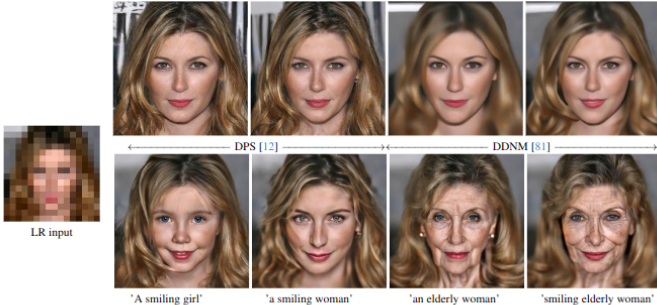

# Text-guided Explorable Image Super-resolution (CVPR 2024)
Code for the CVPR 2024 [paper](https://openaccess.thecvf.com/content/CVPR2024/html/Gandikota_Text-guided_Explorable_Image_Super-resolution_CVPR_2024_paper.html) **Text-guided Explorable Image Super-resolution**.


## Environment settings and libraries we used in our experiments

This project is tested on a machine with
- OS: Ubuntu 22.04.4 
- GPU: NVIDIA GeForce RTX 3090 

Comprehensive list of packages used in the environment used for experiments are provided in requirements.txt

## Acknowledgement
The codes are based on [deep-floyd IF](https://github.com/deep-floyd/IF), [karlo unCLIP](https://github.com/kakaobrain/karlo), using [Huggingface Diffusers](https://github.com/huggingface/diffusers). Three zero-shot methods [DDNM](https://github.com/wyhuai/DDNM), [DPS](https://github.com/DPS2022/diffusion-posterior-sampling), [PiGDM](https://github.com/NVlabs/RED-diff) are included for text guided super-resolution.
We thank the authors and contributors of these repositories for making their code public!

## Included are
- **Imagen(DeepFloyd-IF) DDNM**
- **Imagen(DeepFloyd-IF) PiGDM**
- **Imagen(DeepFloyd-IF) DPS**

## Coming Soon
- **unCLIP DDNM**.

## Note
We corrected a bug in our computation.The LR PSNRs using using Deepfloyd IF (Imagen) are now better than reported values in the paper.

As mentioned in the discussion section, even with high LR PSNR, results may not always be perceptually high quality. If the result is not satisfactory try running with different random seeds.

## Evaluation on dataset
Download multimodal CelebA HQ to /data/work_data/multi_mod_celebahq


running command for testing 16x SR using  DDNM with classifier free guidance 
```python
python run_dataset_imagen_superresolution.py --count 200 --scale 16 -g1 7 -g2 4 --run 3 --algo ddnm
```

running command for testing 16x SR using  DPS with classifier free guidance 
```python
python run_dataset_imagen_superresolution.py --count 200 --scale 16 -g1 7 -g2 4 --algo dps --dps_scale 0.5 --dec_steps 250 --sr_steps 100 --start_time 100 --run 1
```

running command for testing 16x SR using  PiGDM with classifier free guidance 
```python
python run_dataset_imagen_superresolution.py --count 200 --scale 16 -g1 7 -g2 4 --algo pigdm --dps_scale 0.5 --dec_steps 250 --sr_steps 100 --start_time 100 --run 1
```

Set -g1 1 and -g2 1 for disabling classifier-free guidance in both stages. 

Set --scale 16 for 16x super-resolution.

Modify --dec_steps and --sr_steps to control the number of diffusion steps in the first stage and second stage.


## References
If you find our workuseful for your research, please consider citing
```bib
@InProceedings{Gandikota_2024_CVPR,
    author    = {Gandikota, Kanchana Vaishnavi and Chandramouli, Paramanand},
    title     = {Text-guided Explorable Image Super-resolution},
    booktitle = {Proceedings of the IEEE/CVF Conference on Computer Vision and Pattern Recognition (CVPR)},
    month     = {June},
    year      = {2024},
    pages     = {25900-25911}
}

```


